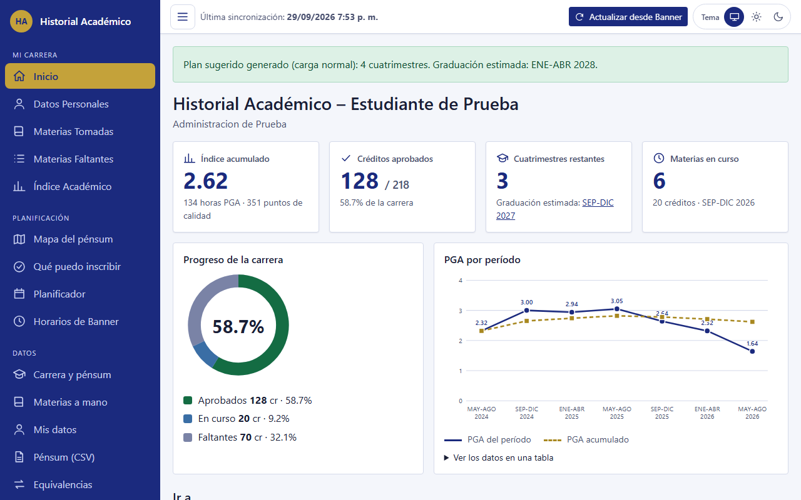
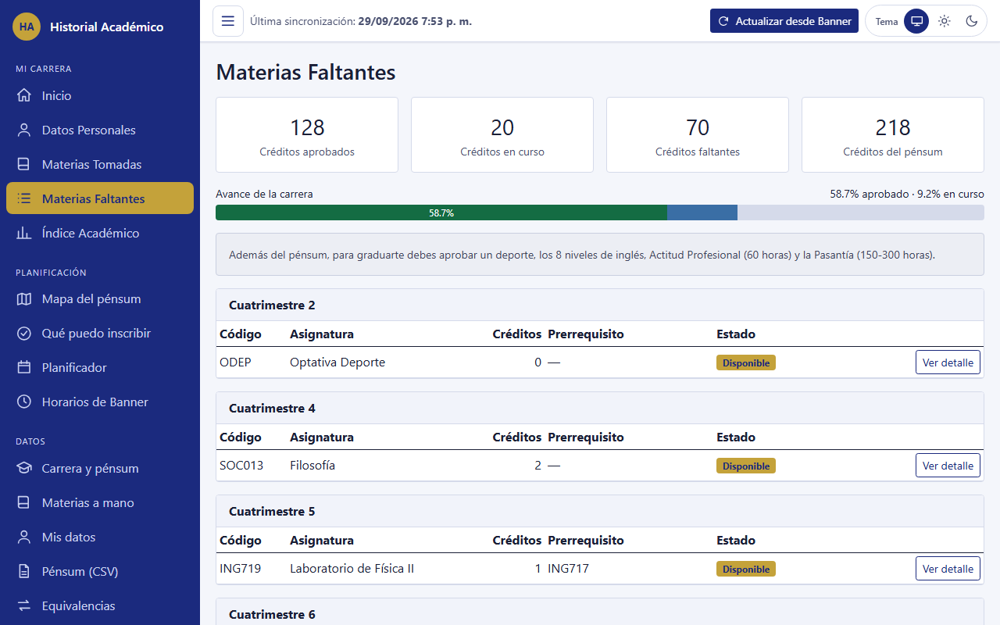
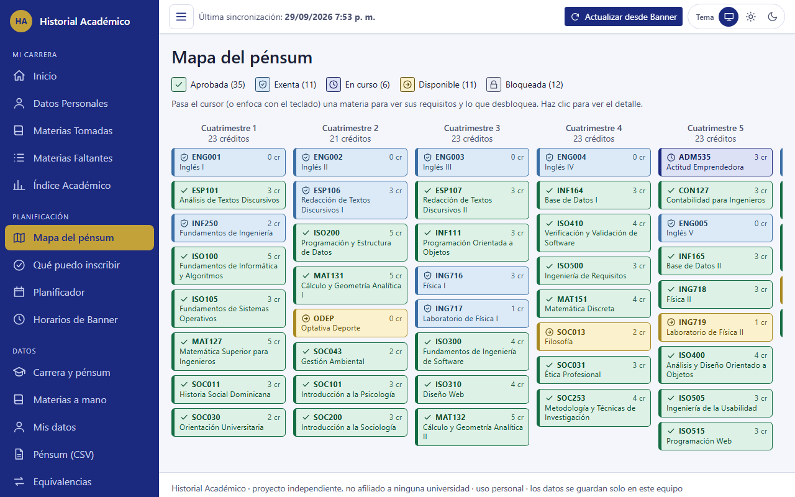
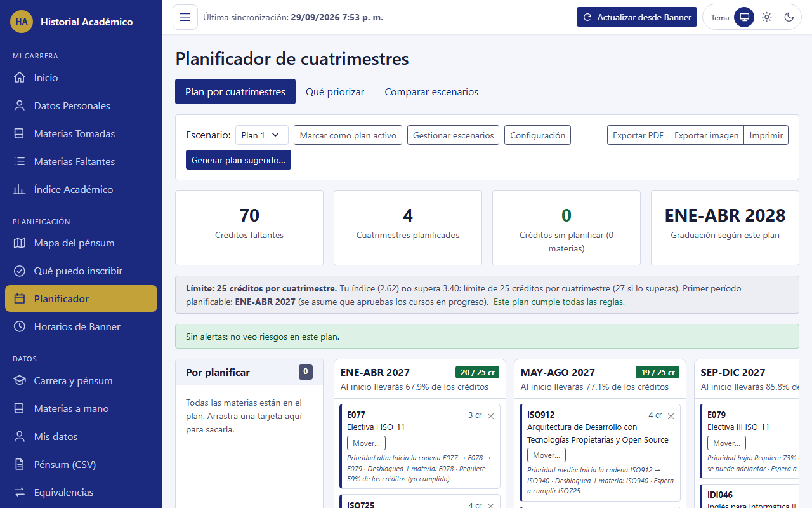

# Historial Académico

Una aplicación **para estudiantes universitarios** que corre en tu propia computadora: lee tu histórico académico desde Banner,
te dice cómo vas en tu carrera y te ayuda a planificar los próximos cuatrimestres.

> **Proyecto independiente.** No está afiliado, patrocinado ni avalado por ninguna universidad. Los nombres de universidades y
> sistemas que aparecen aquí (UNAPEC, Banner…) pertenecen a sus dueños y se mencionan solo para explicar con qué funciona.
> Los planes de estudio los aportan personas de la comunidad: **confírmalos siempre con tu asesor académico**.



## Qué hace

- **Tu situación de un vistazo:** índice acumulado, créditos aprobados, avance de la carrera, PGA por período y graduación estimada.
- **Materias tomadas y faltantes**, con el detalle de cada una y sus prerrequisitos.
- **Mapa del pénsum** y **«Qué puedo inscribir»**: qué materias ya puedes tomar y cuáles siguen bloqueadas.
- **Planificador de cuatrimestres:** genera un plan sugerido, lo puedes ajustar arrastrando materias, compara escenarios, avisa si algo
  incumple prerrequisitos o el límite de créditos, simula tu índice y se exporta a PDF o imagen.
- **Horarios de Banner:** consulta las secciones abiertas y arma un horario tentativo sin choques.
- **Varias personas, un mismo computador:** cada perfil tiene su propia información y, si quiere, un PIN.
- **Sin Banner también sirve:** puedes escribir tus materias a mano.
- **Tu carrera, tu universidad:** los pénsums son archivos JSON; puedes [agregar el tuyo](CONTRIBUTING-pensums.md) sin programar.

| Materias faltantes | Mapa del pénsum |
| --- | --- |
|  |  |



_Las capturas usan datos ficticios._

## Requisitos

- **Windows 10 u 11 (64 bits).** El instalador (Opción A) es para Windows. Para macOS y Linux se publican también archivos ya hechos, pero solo se prueban de forma automática en Windows: si algo falla, cuéntanoslo en un _issue_. En cualquier sistema puedes compilarlo tú (Opción B).
- **Internet la primera vez**, para descargar Chromium (unos 150 MB). Con el instalador, la aplicación lo descarga sola al abrirse y muestra el avance en su ventana; si lo compilas tú, lo instalas con un comando (Opción B). Solo se usa para que inicies sesión
  en Banner y para exportar el plan a PDF o imagen.
- Una cuenta de Banner de tu universidad (opcional: sin ella puedes usar la aplicación con tus materias escritas a mano).

## Instalación paso a paso

<!-- ESTADO-RELEASE: borrar este bloque cuando salga la primera versión estable (ver «Publicar una versión» en CONTRIBUTING.md) -->
> **Estado actual:** todavía no hay una versión estable. En la pestaña Releases solo hay versiones de prueba (marcadas **Pre-release**): puedes usar su instalador y nos ayudas a probarlo, pero pueden tener fallos. Si prefieres lo más seguro, usa la **Opción B**.
<!-- /ESTADO-RELEASE -->

### Opción A: el instalador de Windows (no necesitas instalar nada más)

No hace falta instalar .NET, Git ni ningún otro programa: el instalador trae todo lo que la aplicación necesita, y el navegador que usa para Banner lo descarga ella sola.

1. Entra a la pestaña **Releases** de este repositorio, abre la versión más reciente y, en **Assets**, descarga el archivo
   **`HistorialAcademico-Instalador-vX.Y.Z.exe`**.
2. Haz doble clic en el archivo descargado. Si Windows muestra «Windows protegió su PC», es porque el instalador no está firmado (firmarlo cuesta dinero
   y este es un proyecto gratuito de la comunidad): pulsa **Más información** y luego **Ejecutar de todas formas**.
3. En el instalador pulsa **Siguiente** y después **Instalar**. No te pide contraseña de administrador. Deja marcada la casilla del acceso directo en el Escritorio si lo quieres.
4. Al terminar queda abierta «Abrir Historial Académico ahora»: pulsa **Finalizar**. Se abre una **ventana negra** (déjala abierta mientras usas la aplicación)
   y, en unos segundos, tu navegador en `http://localhost:5296`.
5. **La primera vez** la ventana negra descarga el navegador que necesita (Chromium, unos 150 MB) y muestra el avance. Espera unos minutos; no la cierres.
6. Sigue el asistente de cuatro pasos: crear tu perfil, elegir tu universidad y carrera, conectar Banner (opcional) y sincronizar.

**Después:** abre la aplicación desde el acceso directo del Escritorio o desde el menú Inicio («Historial Académico»). Para salir, cierra la ventana negra.
Si el puerto 5296 está ocupado, el programa usa el siguiente libre y te lo dice en esa ventana.

**Actualizar:** la aplicación avisa cuando hay una versión nueva. Descarga su instalador y ábrelo: se instala encima de la anterior y **no pierdes tus datos**.

**Desinstalar:** Configuración → Aplicaciones → Historial Académico. Tus datos se quedan en `%LOCALAPPDATA%\HistorialAcademico`; si quieres borrarlos,
hazlo antes desde «Mis datos» en la aplicación (o elimina esa carpeta).

**Otros sistemas y sin instalar:** en el mismo Release hay un `.zip` para Windows que no instala nada (descomprímelo y abre `HistorialAcademico.Web.exe`)
y archivos `linux-x64`, `osx-arm64` y `osx-x64` para Linux y Mac (descomprime y ejecuta `HistorialAcademico.Web`). Junto a los archivos está `SHA256SUMS.txt`
por si quieres comprobar que la descarga no se dañó.

### Opción B: compilarlo tú (funciona hoy)

1. Instala el [SDK de .NET 8](https://dotnet.microsoft.com/download) y [Git](https://git-scm.com/downloads).
2. En una terminal:

   ```bash
   git clone https://github.com/JulianBaez1229/Historial-Academico.git
   cd Historial-Academico
   dotnet build
   pwsh HistorialAcademico.Banner/bin/Debug/net8.0/playwright.ps1 install chromium
   dotnet run --project HistorialAcademico.Web
   ```

   (`pwsh` es [PowerShell 7](https://learn.microsoft.com/powershell/scripting/install/installing-powershell); solo hace falta ese paso una vez.)
3. Abre `http://localhost:5296` en tu navegador.

### La primera vez

1. **Crea tu perfil** (un nombre y, si quieres, un PIN).
2. **Elige tu universidad y tu carrera.** Si la tuya no está, sigue [esta guía](CONTRIBUTING-pensums.md) o pega el texto de tu plan de estudios en «Carrera y pénsum».
3. **Conecta Banner:** se abre una ventana de Chromium con la página de tu universidad. **Inicia sesión tú** (con el segundo factor si te lo pide)
   y no cierres la ventana; se cierra sola al terminar. Tienes hasta 5 minutos.
4. Listo: en «Inicio» ves tu situación. Para actualizarla más adelante, pulsa **Actualizar desde Banner**.

## Preguntas frecuentes

**¿Mi universidad usa otro sistema o no usa Banner?** Puedes usar la aplicación sin conectar Banner: escribe tus materias en «Materias a mano».
Los lectores de Banner están hechos con el formato de UNAPEC; si tu Banner se ve distinto, abre un _issue_ con una muestra
[anonimizada](tests/samples/README.md) y lo revisamos.

**¿Dónde está mi carrera?** Los pénsums son archivos en la carpeta [`pensums/`](pensums/README.md). Agregar el tuyo no requiere programar:
[guía paso a paso](CONTRIBUTING-pensums.md).

**Dice que falta el navegador de Playwright.** Instálalo una vez con el comando de la «Opción B», paso 2 (el de `playwright.ps1 install chromium`).

**Se cerró la ventana de Banner antes de tiempo o pasaron los 5 minutos.** Vuelve a pulsar **Actualizar desde Banner** e inicia sesión con calma.

**¿Puedo usarla en dos computadoras?** Sí, pero cada una guarda sus propios datos. Desde «Mis datos» puedes exportar una copia de tu información.

**Mi índice no coincide con el de Banner.** La aplicación lo calcula con la escala de tu universidad y lo contrasta con el de Banner; si difieren,
lo avisa en pantalla. Banner manda: revisa tu histórico oficial.

**¿Cómo la desinstalo y borro todo?** Entra a «Mis datos» y elige **borrar todos mis datos**; después elimina la carpeta del programa.

## Privacidad

- **Todo pasa en tu computadora.** No hay servidor central, cuentas ni estadísticas de uso: nada de tu información sale de tu equipo.
- **La aplicación nunca ve tu contraseña.** Inicias sesión tú mismo en el sitio de tu universidad, en una ventana de navegador.
  Después solo se guarda la sesión de Banner (una cookie) en tu carpeta de usuario, para no pedírtela cada vez.
- **Tus datos viven fuera del proyecto:** en `%LOCALAPPDATA%\HistorialAcademico` (una carpeta por perfil). Nunca se guardan dentro de la carpeta del programa
  ni del repositorio.
- **Solo consulta cuando tú lo pides.** Banner se consulta al pulsar «Actualizar» o al explorar horarios, con pausas entre peticiones; no hay consultas en segundo plano.
- **Aviso de versiones nuevas (el programa descargado):** al abrirse pregunta una sola vez a GitHub cuál es la última versión publicada. Es una consulta pública, sin
  cuenta: GitHub ve tu dirección IP y el nombre y la versión del programa, nada más. Si hay una nueva, verás una franja discreta con el enlace (puedes ignorar esa versión).
  Puedes **apagarlo** en «Mis datos → Avisos de versiones nuevas»: apagado, la aplicación no se conecta a ningún lado por su cuenta. Compilado desde el código, nunca consulta.
- **De otras personas solo guarda lo mínimo:** los nombres de los profesores que Banner publica en los horarios.
- **Eres dueño de tus datos:** «Mis datos» te deja llevarte una copia en JSON o borrarlo todo.

Si compartes una captura, un archivo de muestra o un _issue_, revisa antes que no lleve tu nombre, tu matrícula ni tus notas.
Para muestras usa el [anonimizador](tests/samples/README.md).

## Contribuir

¡Ayuda bienvenida! Lee [CONTRIBUTING.md](CONTRIBUTING.md). Para agregar una carrera: [CONTRIBUTING-pensums.md](CONTRIBUTING-pensums.md).

## Licencia

[MIT](LICENSE) © 2026 Julian Baez Mena.
